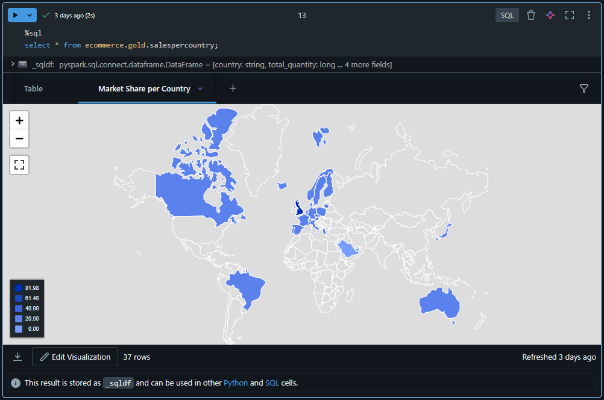
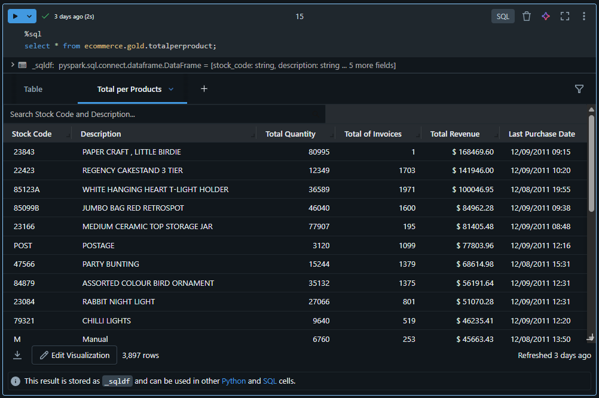
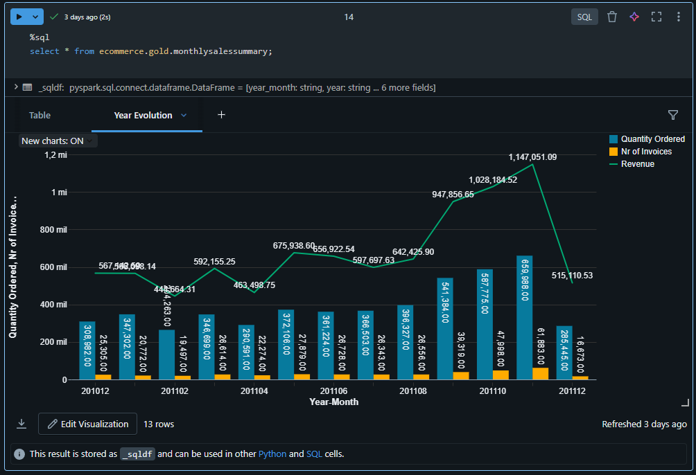
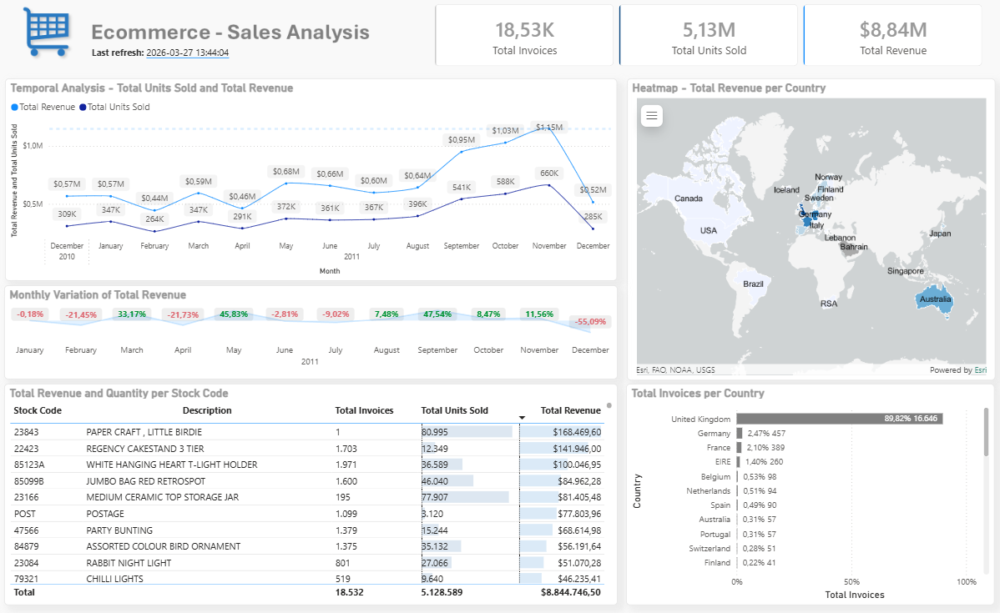

# 🎲 Ecommerce Data Pipeline - Databricks
A complete end-to-end implementation of the Medallion architecture in a pipeline for ecommerce data in Databricks.

## 🪪 Project Overview
This project aims to implement a data pipeline using the Databricks platform, ingesting the data provided in a public source, treating it and generating business value with the data that was obtained. For this project, an Ecommerce public data was used, provided by the Kaggle platform. Afterwards, the Medallion architecture was implemented, taking advantage of the Bronze, Silver and Gold layers, following the conventions and best practices for it's development.

Lastly, a Power BI report was built with the data provided by the Silver layer (activity that would be performed by a Data Analyst, for example), in order to present the information in a customized manner.

## 🛠️ Requirements and Tools
We can find the necessary technical requirements for this project.
- [Ecommerce Dataset](https://www.kaggle.com/datasets/carrie1/ecommerce-data) - Available at Kaggle
	- Data that was used in the pipeline implementation. We used the Kagglehub library in order to download the dataset inside the Databricks environment.
- Databricks - Free Edition
	- The whole project was developed using the Databricks - Free Edition environment. It is recomended this or the Premium edition for future replications of this project.
- Power BI Desktop
  - The Power BI report was developed using Power BI Desktop.

## 🏛️ Architecture and Design
The pipeline was developed using the ELT model (Extract, Load and Transform), following the principles below:
- Grabs the data present in the Kaggle platform
- Store the data in Databricks
- Treat and serve the data
- Generate information using the treated data
In order to implement those steps, it was adopted the Medallion architecture that consists in three layers: Bronze, Silver and Gold, in which each of them represents a state of our data.
1) Bronze (Raw): In this first step, we perform the ingestion and staging of our data in it's original form, creating features for the tracking and monitoring of each ingestion.
2) Silver (Cleared): Here, we start to clear and treat the data present in the Bronze layer (Dealing with missing data, establishing data schema and enforcing feature types). The most important part of this step is to ensure data quality, atomicity and integrity.
3) Gold (Curated): In the last step, we start to generate information and knowledge from the curated data present in the Silver layer, such as daily reports and executive summaries.
In this project, two implementations were created in order to demonstrate how we can extract value from the data that was ingested:
- Reports created in the Gold Layer - Designed for quick insights and recurrent reports for executive summaries.

**Sales Per Country**

**Total per Product**

**Monthly Sales Summary**

All of the reports above were created directly in Databricks, very fitting for quick summaries. 

- A Power BI Dashboard connected to the Silver layer in order to present the information in a more customized and in-depth manner.

---
*Developed by [Diego Freire](https://github.com/diegofreiregit)*
